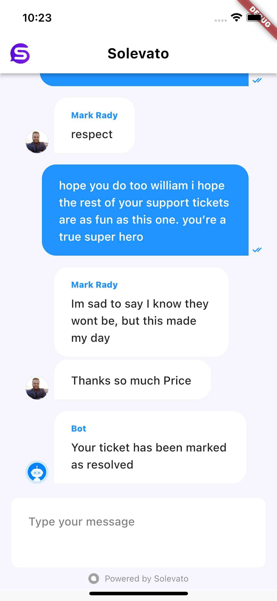

# Integrate Solevato with Flutter app

Integrate Solevato flutter client into your flutter app and talk to your visitors in real time. [Solevato](https://bitbucket.org/mark_rady/solevato-flutter-sdk) helps you to chat with your visitors and provide exceptional support in real time. To use Solevato in your flutter app, follow the steps described below.



## 1. Create an Api inbox in Solevato Dashboard

## 2. Add the package to your project

Run the command below in your terminal

`flutter pub add solevato_client_sdk_flutter`


or

Add
`solevato_client_sdk_flutter:<<version>>`
to your project's [pubspec.yml](https://flutter.dev/docs/development/tools/pubspec) file. You can check [here](https://pub.dev/packages/solevato_client_sdk_flutter) for the latest version.


NB: This library uses [Hive](https://pub.dev/packages/hive) for local storage and [Flutter Chat UI](https://pub.dev/packages/flutter_chat_ui) for its user interface.

## 3. How to use
Replace `inboxIdentifier` with appropriate values from your dashboard

### a. Using SolevatoChatDialog
Simply call `SolevatoChatDialog.show` with your parameters to show chat dialog. To close dialog use `Navigator.pop(context)`.

```
// Example
SolevatoChatDialog.show(
  context,
  inboxIdentifier: "<<<your-inbox-identifier-here>>>",
  title: "Solevato Support",
  user: SolevatoUser(
    identifier: "mark@example.com",
    name: "Mark Rady",
    email: "mark@example.com",
  ),
);
```
#### Available Parameters
| Name              | Default                   | Type         | Description                                                                                                                                                                                                                                                                                                                                                                                                                                         |
|-------------------|---------------------------|--------------|-----------------------------------------------------------------------------------------------------------------------------------------------------------------------------------------------------------------------------------------------------------------------------------------------------------------------------------------------------------------------------------------------------------------------------------------------------|
| context           | -                         | BuildContext | Current BuildContext                                                                                                                                                                                                                                                                                                                                                                                                                                |
| inboxIdentifier   | -                         | String       | Identifier for target solevato inbox                                                                                                                                                                                                                                                                                                                                                                                                                |
| enablePersistance | true                      | bool         | Enables persistence of solevato client instance's contact, conversation and messages to disk <br>for convenience.<br>true - persists solevato client instance's data(contact, conversation and messages) to disk. To clear persisted <br>data call SolevatoClient.clearData or SolevatoClient.clearAllData<br>false - holds solevato client instance's data in memory and is cleared as<br>soon as solevato client instance is disposed<br>Setting  |
| title             | -                         | String       | Title for modal                                                                                                                                                                                                                                                                                                                                                                                                                                     |
| user              | null                      | SolevatoUser | Custom user details to be attached to solevato contact                                                                                                                                                                                                                                                                                                                                                                                              |
| primaryColor      | Color(0xff1f93ff)         | Color        | Primary color for SolevatoChatTheme                                                                                                                                                                                                                                                                                                                                                                                                                 |
| secondaryColor    | Colors.white              | Color        | Secondary color for SolevatoChatTheme                                                                                                                                                                                                                                                                                                                                                                                                               |
| backgroundColor   | Color(0xfff4f6fb)         | Color        | Background color for SolevatoChatTheme                                                                                                                                                                                                                                                                                                                                                                                                              |
| l10n              | SolevatoL10n()            | SolevatoL10n | Localized strings for SolevatoChat widget.                                                                                                                                                                                                                                                                                                                                                                                                          |
| timeFormat        | DateFormat.Hm()           | DateFormat   | Date format for chats                                                                                                                                                                                                                                                                                                                                                                                                                               |
| dateFormat        | DateFormat("EEEE MMMM d") | DateFormat   | Time format for chats      

### b. Using SolevatoChat Widget
To embed SolevatoChat widget inside a part of your app, use the `SolevatoChat` widget. Customize chat UI theme by passing a `SolevatoChatTheme` with your custom theme colors and more.

```
import 'package:solevato_client_sdk_flutter/solevato_client_sdk_flutter.dart';
import 'package:flutter/material.dart';

void main() {
  runApp(MyApp());
}

class MyApp extends StatelessWidget {
  // This widget is the root of your application.
  @override
  Widget build(BuildContext context) {
    return MaterialApp(
      title: 'Flutter Demo',
      theme: ThemeData(
        primarySwatch: Colors.blue,
      ),
      home: MyHomePage(title: 'Flutter Demo Home Page'),
    );
  }
}

class MyHomePage extends StatefulWidget {
  MyHomePage({Key key, this.title}) : super(key: key);

  final String title;

  @override
  _MyHomePageState createState() => _MyHomePageState();
}

class _MyHomePageState extends State<MyHomePage> {

  @override
  Widget build(BuildContext context) {
    return SolevatoChat(
      inboxIdentifier: "<<<your-inbox-identifier-here>>>",
      user: SolevatoUser(
        identifier: "john@gmail.com",
        name: "John Samuel",
        email: "john@gmail.com",
      ),
      appBar: AppBar(
        title: Text(
          "Solevato",
          style: TextStyle(
            color: Colors.black,
            fontWeight: FontWeight.bold
          ),
        ),
        backgroundColor: Colors.white,
      ),
      onWelcome: (){
        print("Welcome event received");
      },
      onPing: (){
        print("Ping event received");
      },
      onConfirmedSubscription: (){
        print("Confirmation event received");
      },
      onMessageDelivered: (_){
        print("Message delivered event received");
      },
      onMessageSent: (_){
        print("Message sent event received");
      },
      onConversationIsOffline: (){
        print("Conversation is offline event received");
      },
      onConversationIsOnline: (){
        print("Conversation is online event received");
      },
      onConversationStoppedTyping: (){
        print("Conversation stopped typing event received");
      },
      onConversationStartedTyping: (){
        print("Conversation started typing event received");
      },
    );
  }
}
```

Horray! You're done.


#### Available Parameters
| Name              | Default                   | Type                | Description                                                                                                                                                                                                                                                                                                                                                                                                                                         |
|-------------------|---------------------------|---------------------|-----------------------------------------------------------------------------------------------------------------------------------------------------------------------------------------------------------------------------------------------------------------------------------------------------------------------------------------------------------------------------------------------------------------------------------------------------|
| appBar            | null                      | PreferredSizeWidget | Specify appBar if widget is being used as standalone page                                                                                                                                                                                                                                                                                                                                                                                           |
| inboxIdentifier   | -                         | String              | Identifier for target solevato inbox                                                                                                                                                                                                                                                                                                                                                                                                                |
| enablePersistance | true                      | bool                | Enables persistence of solevato client instance's contact, conversation and messages to disk <br>for convenience.<br>true - persists solevato client instance's data(contact, conversation and messages) to disk. To clear persisted <br>data call SolevatoClient.clearData or SolevatoClient.clearAllData<br>false - holds solevato client instance's data in memory and is cleared as<br>soon as solevato client instance is disposed<br>Setting  |
| user              | null                      | SolevatoUser        | Custom user details to be attached to solevato contact                                                                                                                                                                                                                                                                                                                                                                                              |
| l10n              | SolevatoL10n()            | SolevatoL10n        | Localized strings for SolevatoChat widget.                                                                                                                                                                                                                                                                                                                                                                                                          |
| timeFormat        | DateFormat.Hm()           | DateFormat          | Date format for chats                                                                                                                                                                                                                                                                                                                                                                                                                               |
| dateFormat        | DateFormat("EEEE MMMM d") | DateFormat          | Time format for chats                                                                                                                                                                                                                                                                                                                                                                                                                               |
| showAvatars       | true                      | bool                | Show avatars for received messages                                                                                                                                                                                                                                                                                                                                                                                                                  |
| showUserNames     | true                      | bool                | Show user names for received messages. 


### c. Using Solevato Client
You can also create a customized chat ui and use `SolevatoClient` to load and sendMessages. Messaging events like `onMessageSent` and `onMessageReceived` will be triggered on `SolevatoCallback` passed when creating the client instance.

```
final SolevatoCallbacks = SolevatoCallbacks(
      onWelcome: (){
        print("on welcome");
      },
      onPing: (){
        print("on ping");
      },
      onConfirmedSubscription: (){
        print("on confirmed subscription");
      },
      onConversationStartedTyping: (){
        print("on conversation started typing");
      },
      onConversationStoppedTyping: (){
        print("on conversation stopped typing");
      },
      onPersistedMessagesRetrieved: (persistedMessages){
        print("persisted messages retrieved");
      },
      onMessagesRetrieved: (messages){
        print("messages retrieved");
      },
      onMessageReceived: (SolevatoMessage){
        print("message received");
      },
      onMessageDelivered: (SolevatoMessage, echoId){
        print("message delivered");
      },
      onMessageSent: (SolevatoMessage, echoId){
        print("message sent");
      },
      onError: (error){
        print("Ooops! Something went wrong. Error Cause: ${error.cause}");
      },
    );
    
    SolevatoClient.create(
        inboxIdentifier: widget.inboxIdentifier,
        user: widget.user,
        enablePersistence: widget.enablePersistence,
        callbacks: SolevatoCallbacks
    ).then((client) {
        client.loadMessages();
    }).onError((error, stackTrace) {
      print("solevato client creation failed with error $error: $stackTrace");
    });
```
#### Available Parameters
| Name              | Default | Type              | Description                                                                                                                                                                                                                                                                                                                                                                                                                                         |
|-------------------|---------|-------------------|-----------------------------------------------------------------------------------------------------------------------------------------------------------------------------------------------------------------------------------------------------------------------------------------------------------------------------------------------------------------------------------------------------------------------------------------------------|
| inboxIdentifier   | -       | String            | Identifier for target solevato inbox                                                                                                                                                                                                                                                                                                                                                                                                                |
| enablePersistance | true    | bool              | Enables persistence of solevato client instance's contact, conversation and messages to disk <br>for convenience.<br>true - persists solevato client instance's data(contact, conversation and messages) to disk. To clear persisted <br>data call SolevatoClient.clearData or SolevatoClient.clearAllData<br>false - holds solevato client instance's data in memory and is cleared as<br>soon as solevato client instance is disposed<br>Setting  |
| user              | null    | SolevatoUser      | Custom user details to be attached to solevato contact                                                                                                                                                                                                                                                                                                                                                                                              |
| callbacks         | null    | SolevatoCallbacks | Callbacks for handling solevato events                                                                                                                                                                                                                                                                                                                                                                                                              |

